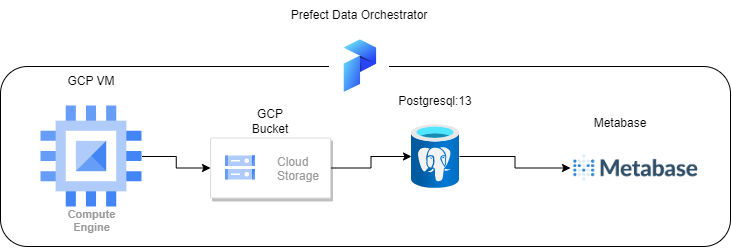
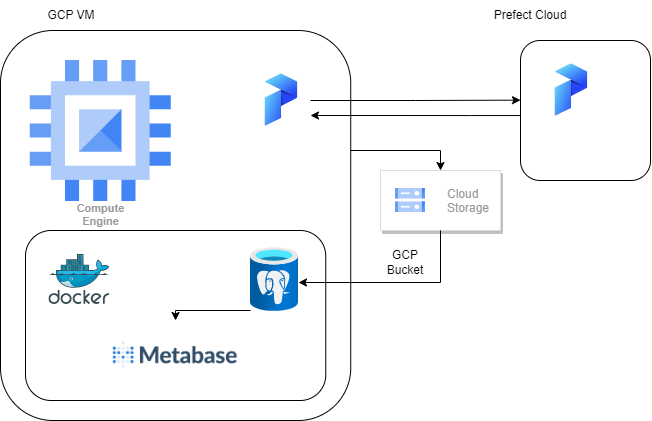

# Dashboard Analytics

project sederhana ini adalah melakukan scrap data dari salah satu portal berita 
dengan keyword yang sudah di tentukan, untuk dijadikan analisis sederhana melihat
populeritas tokoh politik dalam negeri. 

dashboard bisa di akses pada link berikut :
- [de_analytics_dashboard](http://35.223.23.31:3000/public/dashboard/53ca46a7-2745-406e-ac8e-482846b61675)

## dataflow



Pipline data flow : 
1. scrapper mencari news yang berkaitan dengan keyword dan melakukan upload ke GCS bucket dalam bentuk '.parquet'.
2. data scraper di ingest ke dalam postgresql.
3. counter popularity (python code) sebagai counter popularitas tokoh yang di visualisasikan ke metabase.

## architecture / technology used



Technology yang digunakan :
1. vm di gcloud as a server
2. [docker](https://www.docker.com/) as container oschestrator
3. postgresql as database
4. metabase as visualization
5. [prefect](https://prefect.io/) as data orchestrator
6. google storage bucket as datalake

## python

to generate what existing libs

```
pip freeze >> requirements.txt
```

## google 

1. create project 
2. create vm
3. create bucket
4. create service account, generate json service account key

### google vm

```
export GOOGLE_APPLICATION_CREDENTIALS="<path/to/your/service-account-authkeys>.json"
gcloud auth application-default login
```
*Note* service account digunakan untuk permission utk mengakses resource pada gcp 

```
ssh-keygen -t rsa -f ~/.ssh/KEY_FILENAME -C USERNAME -b 2048
```

*Note* generate keygen utk remote ssh dari local wsl ke ubuntu vm di gcloud console. 

### google bucket


## prefect 

1. prefect agent running di local
2. prefect cloud running di cloud menggantikan prefect UI, 

syntax :

```
prefect server start
prefect agent start -q 'default'
```

```
nohup prefect server start > server.logs
nohup prefect agent start -q 'default' > agent.logs

```
*Note* prefect server tidak digunakan karena sudah digantikan oleh prefect cloud

## docker 


### 1. metabase

Metabase digunakan untuk dashboard analytics tingkat popularitas tokoh politik
- file [docker-compose](metabase/docker-compose.yml)
- services :
    1. metabase
    2. postgresql

### 2. postgresql

Postgresql digunakan sebagai target db datawarehouse.

- file [docker compose](/container/docker-compose.yml)


If you see that folder pg_data is empty after running the container, try these:

Deleting the folder and running Docker again (Docker will re-create the folder)
Adjust the permissions of the folder by running 

Syntax needed : 

```
sudo chmod a+rwx {your_folder_name}
```

### 3. pgadmin

pgdmin digunakan sebagai postgresql developer tools

- file [docker compose](/container/docker-compose.yml)

syntax for pgadmin after docker compose up:

```
sudo chown 5050:5050 data_pgadmin
```

### misc


```
gcsfuse -o allow_other  -file-mode=777 -dir-mode=777 test_bucket_00 /data/cloud/tb-00
```